Conquer KayanK - Development Diary (Phase 1 Status) Overview: KayanK is a custom engine developed in C++ (Win32) and DirectX 11. The goal is to bypass TQ Digital's legacy client and natively render the *Conquer Online* isometric world using hardware acceleration. Currently, the project is in a rapid prototyping phase. The core code within `Conquer.cpp` is somewhat monolithic, but we have already begun isolating responsibilities for Window, Graphics, and Resources. 1. Rendering (Graphics & D3D11): The engine has moved away from GDI/CPU rendering and now operates a true 3D pipeline using shaders (HLSL). Native Widescreen: Window resizing intercepts the Windows event and rebuilds DX11 buffers in real-time; the screen reveals more of the map area rather than simply flattening or stretching the image. Z-Buffer Handling: Z-Write On: Used for the environment and character base meshes to manage isometric depth. Z-Write Off (Z-Read Only): Implemented specifically for particles and wings; this resolved "clipping" issues where transparent objects would erase what was behind them. Blending: Supports standard Alpha Blending and Additive Blending (used so that the glowing cores of particles and spells do not darken the background). 2. Resource Manager (Unpacker and Parser): The resource module reads the original game's binary files directly. .WDF Reader: Capable of building the package index, looking up hashes, and loading files (DDS, C3, ANI) directly into memory without extracting them to disk. Maps (.DMAP / .PUL): Parses the game's mathematical grid and translates logical coordinates to the 2.5D screen. Meshes and Animations (.C3 / .MOT): Extracts vertices, normals, and weights, and converts the original animation's quaternion tracks into rotation matrices. Effect Correction (3DEffect.ini / C3Ptcl): The engine reads magic scripts; we implemented a fix during loading to apply a 90-degree pitch to particles (such as wings), resolving the issue where original models appeared lying flat on the Z-axis. 3. Gameplay Loop (Conquer.cpp): The main loop controls data flow between the parser and the renderer. Delta Time: FPS-independent. Movement and timers (jumping, animation) use real-time differences, ensuring the game runs at the same speed whether at 60 or 300 FPS. Pseudo-3D Physics: We use the 2D screen for movement but calculate a mathematical parabola on the Z-axis (jumpZ) to simulate jump height over the grid. Attach Bones (Sockets): A system that reads the bone hierarchy. We can attach weapons to hands and wings to the spine (Point04), allowing the object to inherit the body's rotation and movement matrices in real-time. Basic Combat: Rudimentary state machine logic. The character pursues, waits for cooldowns, attacks, triggers floating damage numbers, and applies the death state to the monster (using Alpha interpolation to fade it out). 4. Bottlenecks and Next Steps (Phase 2): The prototype proved that rendering works, but we need to resolve some architectural issues to allow the game to scale: CPU Skinning: Animation interpolation (bone matrix multiplication) is currently calculated on the CPU every frame within `GetInterpolatedBone`. To render dozens of players on screen, we need to move this to a Vertex Shader (GPU Skinning). Main Refactoring: `Conquer.cpp` has become massive. We need to migrate entities and combat logic to an ECS (Entity Component System) within the Game DLL. Real Pathfinding (A*): Currently, the player moves in a straight line, ignoring obstacles. We need to integrate mouse input logic with the collision matrix from the `.DMap` file using the A* algorithm. Network: Connect spawn, damage, and equipment ID logic with the TCP packets handled by `Network.dll`.

5. Here are the shortcuts:
6. Number 1: You turn into a small woman
7. Number 2: You turn into a large woman
8. Number 3: You turn into a small man
9. Number 4: You turn into a large man
10. Number 5: You remove all his weapons
11. Number 6: You add a level 130 blade
12. Number 7: You add level 130 dual blades
13. Number 8: You add a blade and a shield
14. Number 9: You equip a bow
15. Number 0: You display the wings
16. For the letter 'E', you add an effect; there is a list of effects in the code.](https://github.com/YKayanK1/ConquerKayanK)

17.	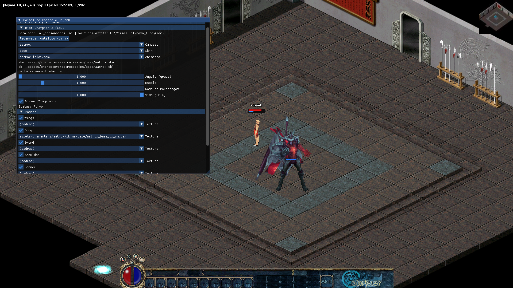
18.	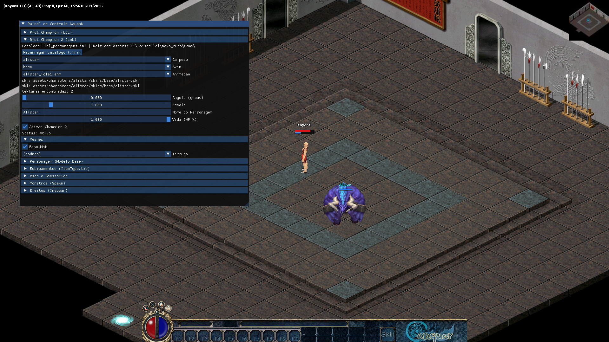
19.	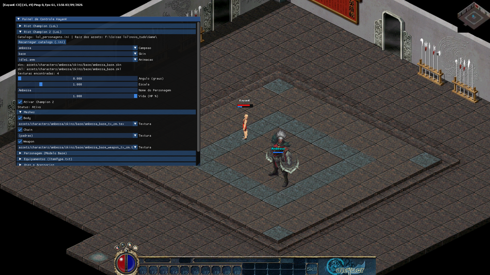
20.	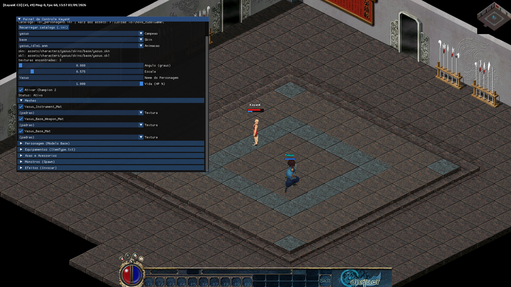
21.	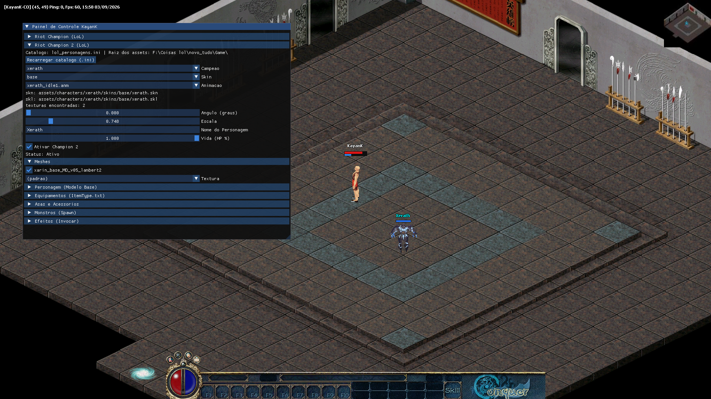
22.	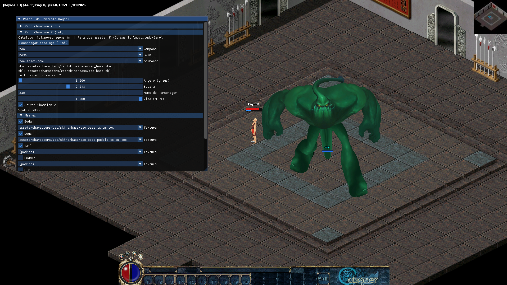
23.	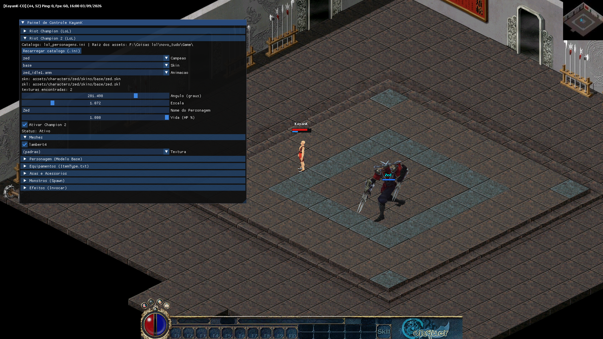
24.	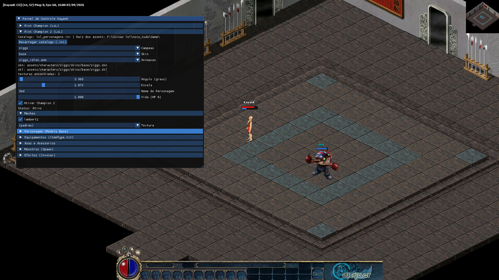
25.	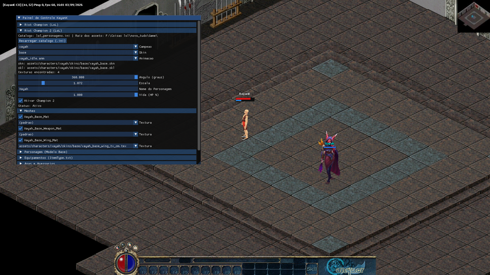
26.	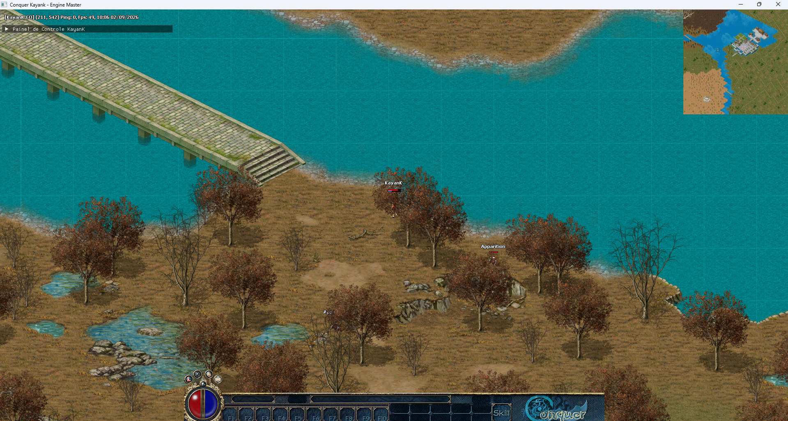
27.	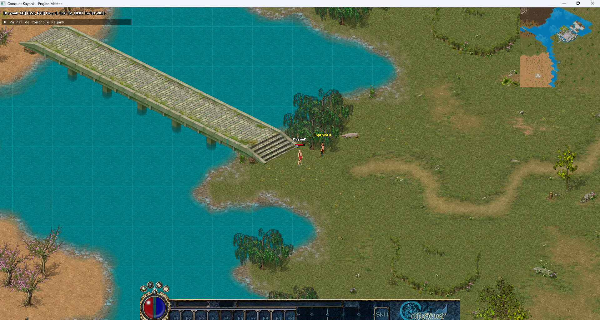
28.	
29.	
30.	
31.	
32.	
33.	
34.	

](https://github.com/YKayanK1/ConquerKayanK)
