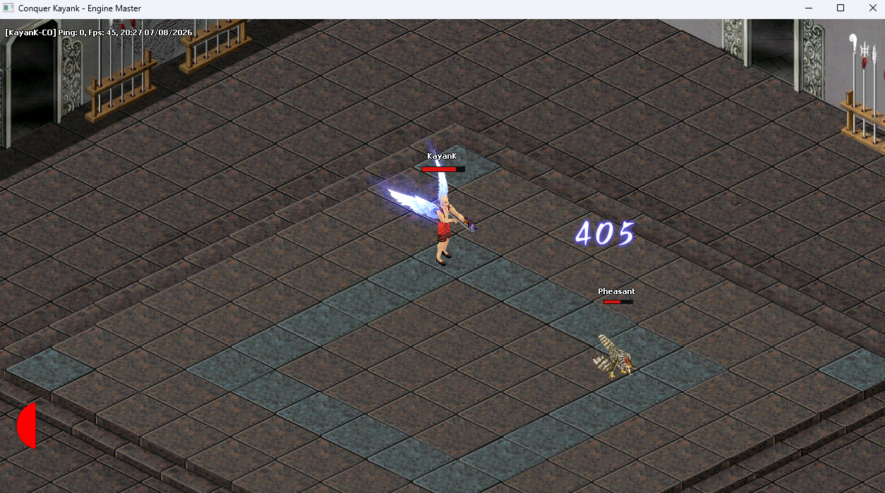
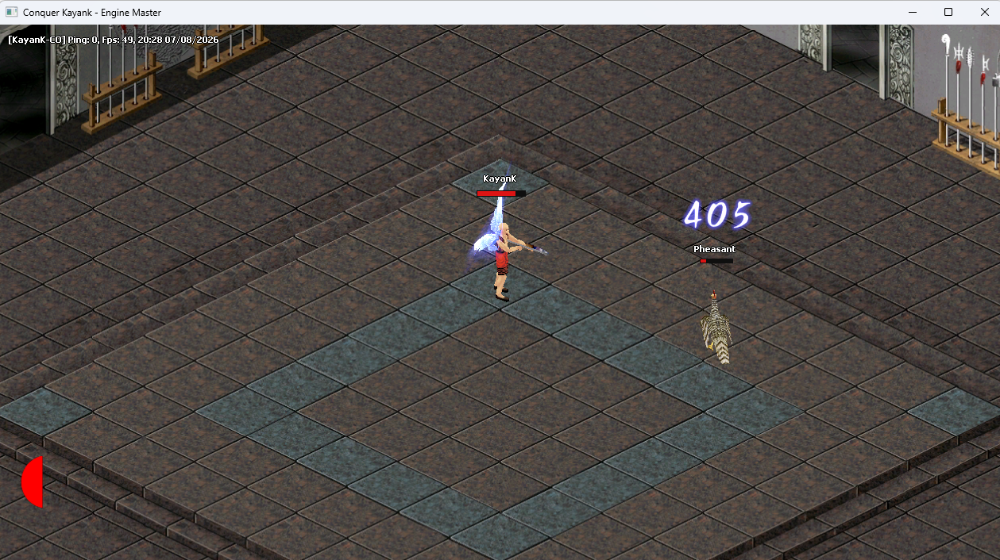
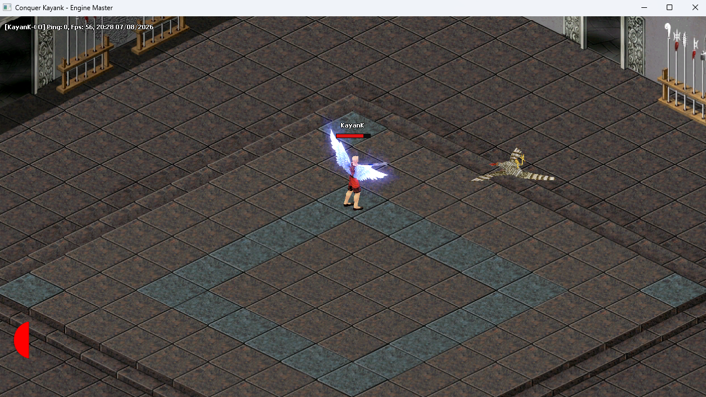
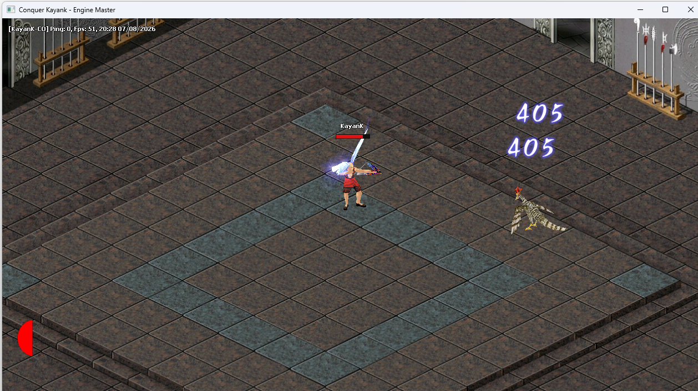
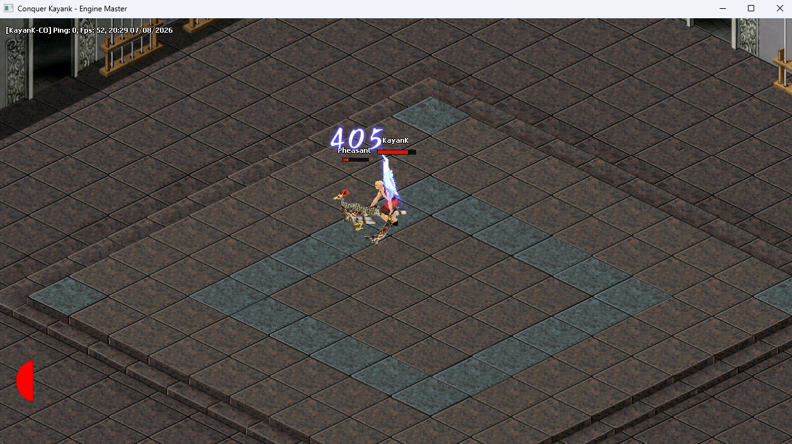
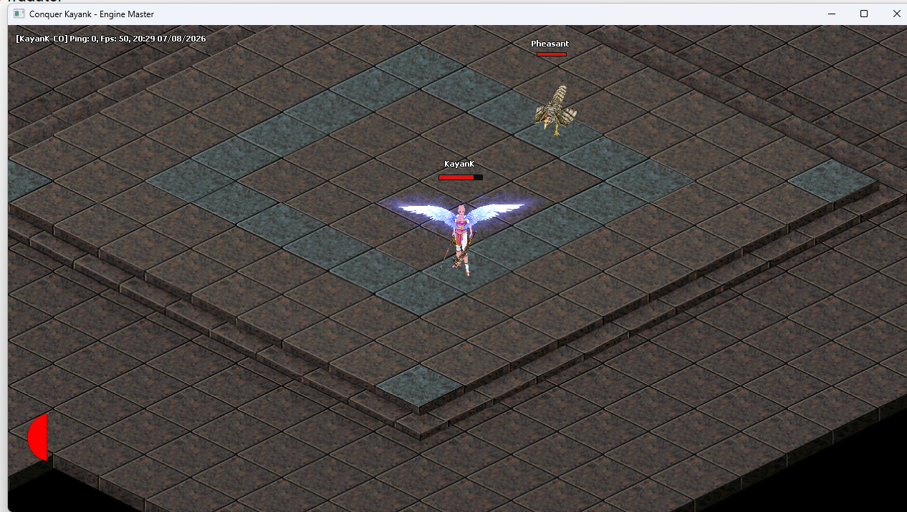
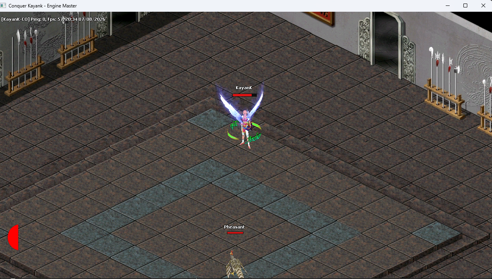

Conquer KayanK: Engine Architecture Report (Phase 1 - Baseline Rendering)
System Overview
Conquer KayanK is a custom engine (written in pure C++ with Win32 API) designed to recreate the 2.5D isometric environment of the classic MMORPG Conquer Online . The engine overcomes the software limitations of the original game by using hardware-accelerated rendering via DirectX 11 .
The current architecture is strictly monolithic for prototyping reasons, but it already separates responsibilities for memory loading (Resource), window logic (Window), and rendering abstraction (Graphics).
1. The Graphics Pipeline (Graphics & DirectX 11)
We replaced the old CPU tests with a genuine D3D11 pipeline. The engine not only "plots pixels," but also has programmed Shaders that handle depth, color blending, and geometric projections.
Current Features:
●	Smart Viewport: Automatic widescreen mode (the screen never flattens, it displays more of the map area when stretched).
●	Multiple Z-Buffers ( depthState ):
○	Z-Write On: Used for character meshes, doors, and objects that cannot be visually traversed.
○	Z-Write Off (Z-Read Only): Created specifically for particles, smoke, and magic, ensuring that the transparent glow obeys 3D space, but without "cutting" invisible objects that are behind it.
●	Dynamic Blending:
○	Alpha Blend (Default): For normal textures and 2D sprites.
○	Additive Blend (Pure Light): Advanced blend for the core of abilities, illuminating the background without making it opaque.
●	DrawMesh3D & DrawParticles: An abstraction where C++ passes matrices (worlds), rotations, and scales via constant buffers to the graphics card for high-performance operation.
2. The Resource Engine (Parser of .C3 and .DMap files)
m_resource component performs reverse engineering on TQ Digital's proprietary native formats.
Current Features:
●	WDF Unpacker: A system capable of reading and extracting .dds , .c3 , and .ani files directly from the giant binary files (.WDF) of the original game, mounting the textures directly into VRAM.
●	Isometric System (.DMAP / .PUL): Converts the isometric mathematical mesh of classic maps into exact 2D positions, handling floor displacements dynamically.
●	3D Mesh Import ( C3Phy ): Reads PHY blocks (TQ Digital's proprietary format containing vertices, normals, and the skeleton).
●	Importing Animations ( C3Motion ): Reading the temporal track. Includes converting Quaternions to rotation matrices (Bone Interpolation).
●	Effects and Spells Engine ( 3DEffect.ini / C3Ptcl ): Reads skill script files, extracts particle tracks from .C3 (Ptcl), and converts simple polygons into glow matrices. The engine is capable of permanently rotating a corrupted model in Pitch/Yaw/Roll before presenting it.
3. The Main Loop (The "Brain" of Conquer.cpp)
WinMain dictates the universe's timeline, rigidly separating Updates from Rendering .
What Has Already Been Implemented:
●	"Delta Time" control: Ensures the character runs at the same speed regardless of whether the PC is running at 20 FPS or 3000 FPS.
●	Pseudo-3D Physics:
○	The screen blends 2D and 3D mathematics simultaneously.
○	The jumps simulate gravity acceleration using parabolic equations ( m_player.jumpZ ) on the 2D sprites of the ground.
●	Modular Equipment System (Armor, Weapons and Wings):
○	"Attachment Bones" concept : Where individual parts (a sword, a glow, or a wing) seek out a specific bone in the central body (right hand, back) and inherit its rotation/animation matrix during rendering.
●	Combat Loop and Cooldowns: The raw logic behind attacking, taking real damage, "fluctuating" damage numbers ( isDamageNumber ), waiting for the safety lock (Cooldown), and applying the "Hit" to monsters, gradually causing their death and "ghostly disappearance."
●	Controlled Zoom System and Camera Pathfinding: Seamless transformation for the mouse ( coordSystem.ScreenToMap ) considering zoom offsets.
4. Limitations and Challenges for Phase 2
Despite the fantastic progress, the current engine works as a "Contained Prototype". To scale into a true MMO, some barriers need to be overcome:
1.	CPU Skinning Bottleneck: Currently, bone interpolation (LerpMatrix) is running on the CPU within GetInterpolatedBone . To render a thousand players in Twin City, this responsibility will need to be transferred to an HLSL Vertex Shader (GPU Skinning).
2.	Entities in a Single File: The Conquer.cpp file concentrates all the rules for the player and monsters in the update loop. This needs to evolve into an ECS (Entity Component System) architecture in separate .h and .cpp files.
3.	Pathfinding Real (A Star): * Today the player walks mathematically "bypassing walls". It is necessary to incorporate the Z-Buffer and the forbidden blocks from the .DMap file into the logic of the mouse.
4.	Client-Server Integration: Armor IDs and monster spawn rates are hardcoded . The next natural step is injecting Network.dll .

5. Here are the shortcuts:
6. Number 1: You turn into a small woman
7. Number 2: You turn into a large woman
8. Number 3: You turn into a small man
9. Number 4: You turn into a large man
10. Number 5: You remove all his weapons
11. Number 6: You add a level 130 blade
12. Number 7: You add level 130 dual blades
13. Number 8: You add a blade and a shield
14. Number 9: You equip a bow
15. Number 0: You display the wings
16. For the letter 'E', you add an effect; there is a list of effects in the code.

17.	
18.	
19.	
20.	
21.	
22.	
23.	

